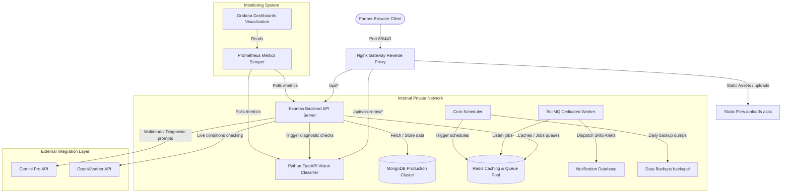
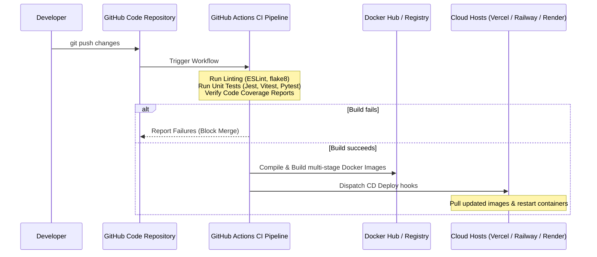

# AgroGuide Technical Architecture & Developer Map

This file details the system structure, data flow diagrams, and architectural layout of the production-ready AgroGuide AI platform.

---

## 1. Directory Structural Map

```text
voice-assistant/
├── .github/
│   └── workflows/
│       └── ci-cd.yml             # Github Actions Automated Workflow Configuration
├── backend/
│   ├── cache/
│   │   └── redisClient.js        # Redis connector with local memory backup fallback
│   ├── config/
│   │   └── db.js                 # MongoDB connection logic
│   ├── controllers/
│   │   ├── authController.js     # User registration and secure cookies management
│   │   └── visionController.js   # Main RAG grounded OpenCV/YOLO diagnostic executor
│   ├── logging/
│   │   └── logger.js             # Structured JSON logger to app.log & error.log
│   ├── middleware/
│   │   ├── csrf.js               # CSRF double-submit token validator middleware
│   │   └── loggingMiddleware.js  # Request ID injection and latency observer
│   ├── monitoring/
│   │   └── performance.js        # prom-client metrics setup for Prometheus
│   ├── schedulers/
│   │   └── backup.js             # MongoDB backup schedule & Redis snapshots triggers
│   ├── server.js                 # Core express API wrapper routing entrypoint
│   ├── package.json              # Backend dependencies, Jest, and script maps
│   └── Dockerfile                # Production multi-stage node builder config
├── frontend/
│   ├── src/
│   │   ├── components/
│   │   │   └── LoadingBubble.test.jsx # RTL/Vitest front-end test suite
│   │   └── tests/
│   │       └── setup.js          # jsdom environment configuration
│   ├── package.json              # React application packages
│   └── Dockerfile                # Multi-stage builder compiling React/Nginx
├── vision-service/
│   ├── tests/
│   │   └── test_main.py          # Pytest image diagnostic validation mocks
│   ├── main.py                   # Python FastAPI image classifier with /metrics
│   ├── requirements.txt          # Python packages (pytest, prometheus-client)
│   └── Dockerfile                # Optimized slim python multi-stage execution container
├── nginx/
│   └── nginx.conf                # Nginx proxy mapping routes and alias folders
├── prometheus/
│   └── prometheus.yml            # Prometheus host targets scrapes config
├── grafana/
│   ├── provisioning/
│   │   ├── dashboards/
│   │   └── datasources/
│   └── dashboards/
│       └── agroguide-dashboard.json # Grafana visual monitoring parameters JSON
└── docker-compose.yml            # Production containers composition orchestrator
```

---

## 2. Production System Architecture



---

## 3. Deployment Flow & CI/CD Pipeline


