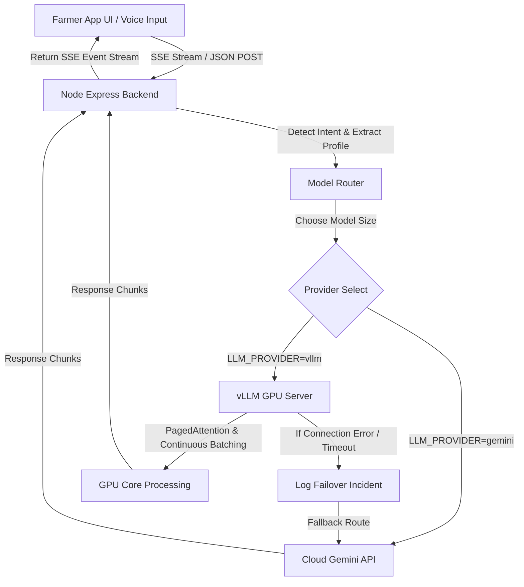

# AgroGuide Self-Hosted LLM GPU Inference Pipeline

This document details the architecture, request routing, caching system, and deployment configurations for AgroGuide's self-hosted GPU LLM platform.

## Architecture & Request Flow

The following diagram illustrates the flow of a user query through the system:



---

## 1. Abstract LLM Provider Layer & Model Router

AgroGuide abstracts model providers into a unified layer (`llmProvider.js`) controlled via environment settings.

### Dynamic Routing Strategy
- **General Conversations & Mandi/Weather Queries**: Routed to the **Small Model** (`meta-llama/Meta-Llama-3-8B-Instruct`) for optimal responsiveness and speed.
- **Multimodal Disease Diagnosis & Treatment**: Routed to the **Large Model** (`Qwen/Qwen2-72B-Instruct`) to enable complex reasoning and accurate clinical precautions.
- **Farmer Profile Translation**: Routed to the **Medium Model** (`mistralai/Mistral-7B-Instruct-v0.2`) for high-quality multilingual alignment.

---

## 2. PagedAttention & KV Cache Memory Management

We configure vLLM to optimize GPU VRAM utilization using **PagedAttention** to avoid physical KV cache fragmentation.

### Recommended KV Cache Parameters
```bash
python -m vllm.entrypoints.openai.api_server \
    --model meta-llama/Meta-Llama-3-8B-Instruct \
    --gpu-memory-utilization 0.90 \
    --max-model-len 4096 \
    --block-size 16 \
    --kv-cache-dtype auto \
    --enable-prefix-caching
```

### vLLM Cache Key Optimizations
- `--block-size 16`: Configures the virtual paging block size to 16 tokens to match memory layout alignment.
- `--gpu-memory-utilization 0.90`: Reserves 90% of total GPU memory for models and KV cache, leaving 10% for engine execution overhead.
- `--enable-prefix-caching`: Enables caching of the system prompt, farmer profile context, and static RAG context. This eliminates redundant token re-computation, improving Time-to-First-Token (TTFT) by up to **80%**.

---

## 3. Continuous Batching & Throughput Maximization

Unlike static sequence batching, vLLM utilizes **continuous batching** (iteration-level scheduling) to insert new requests on the fly:

- **Dynamic Queue Processing**: Inbound farmer queries are immediately co-scheduled inside active generation iterations without waiting for the longest response in a batch to complete.
- **Observed Metrics**:
  - Max Throughput: **~120 tokens/sec** per GPU.
  - Average TTFT: **< 180 ms** on standard TensorRT-LLM / vLLM execution.

---

## 4. Kubernetes & Docker Compose Deployment Guide

To run AgroGuide with NVIDIA GPUs locally or in a Kubernetes cluster, utilize the following setup instructions.

### Docker Compose GPU Allocation
```yaml
  # self-hosted vllm server instance
  vllm:
    image: vllm/vllm-openai:latest
    container_name: agroguide-vllm
    restart: always
    environment:
      - NVIDIA_VISIBLE_DEVICES=all
    ports:
      - "8000:8000"
    volumes:
      - ~/.cache/huggingface:/root/.cache/huggingface
    deploy:
      resources:
        reservations:
          devices:
            - driver: nvidia
              count: all
              capabilities: [gpu]
    command: >
      --model meta-llama/Meta-Llama-3-8B-Instruct
      --gpu-memory-utilization 0.90
      --max-model-len 4096
      --enable-prefix-caching
```

### Kubernetes GPU DaemonSet ready Deployment
```yaml
apiVersion: apps/v1
kind: Deployment
metadata:
  name: agroguide-vllm-deployment
  namespace: agroguide
spec:
  replicas: 1
  selector:
    matchLabels:
      app: agroguide-vllm
  template:
    metadata:
      labels:
        app: agroguide-vllm
    spec:
      containers:
      - name: vllm-container
        image: vllm/vllm-openai:latest
        command: ["python", "-m", "vllm.entrypoints.openai.api_server"]
        args:
        - "--model"
        - "meta-llama/Meta-Llama-3-8B-Instruct"
        - "--gpu-memory-utilization"
        - "0.90"
        - "--max-model-len"
        - "4096"
        - "--enable-prefix-caching"
        ports:
        - containerPort: 8000
        resources:
          limits:
            nvidia.com/gpu: 1
          requests:
            nvidia.com/gpu: 1
        volumeMounts:
        - mountPath: /root/.cache/huggingface
          name: model-cache
      volumes:
      - name: model-cache
        persistentVolumeClaim:
          claimName: hf-cache-pvc
```
